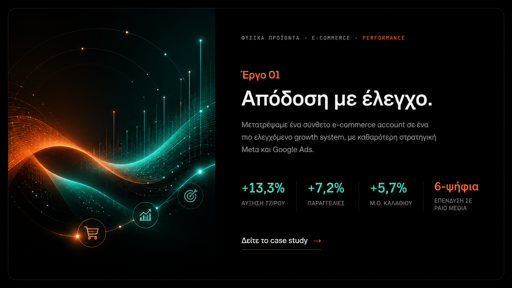
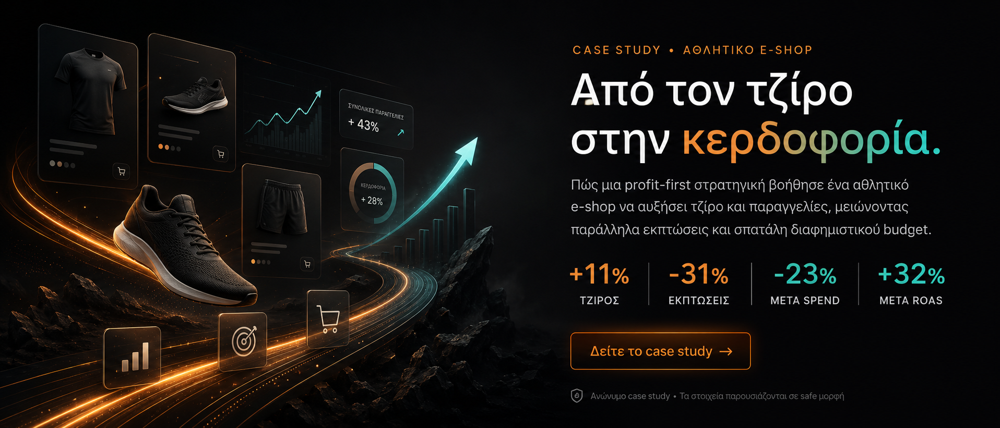

> **ΙΣΤΟΡΙΚΟ ΕΓΓΡΑΦΟ (Ιούλιος 2026).** Από 22/9/2026 οι σελίδες ζουν στο `site/` με καθαρά URL (π.χ. `IG-Digital-Home-GR.dc.html` → `site/el/index.html`). Τα ονόματα αρχείων παρακάτω είναι τα παλιά — δες το README.

# Codex Handoff — Case Studies & Mobile Responsiveness

**Ημερομηνία:** 2026-07-24
**Γράφτηκε από:** Claude (design/creative pass ολοκληρωμένο). Τα παρακάτω είναι **μηχανική δουλειά** — mirroring, μετάφραση, responsive fixes. Ακολούθησε τα ακριβώς.

Διάβασε πρώτα `README.md` + `CHANGELOG.md`. Ισχύουν όλες οι conventions: `.dc.html` production αρχεία, inline styles, `support.js` (ΜΗΝ το αγγίξεις), bilingual mirror, mobile breakpoint **760px**.

---

## Τι έγινε ήδη (μην το ξανακάνεις)
Claude δημιούργησε **2 νέες GR case study σελίδες**, πλήρως responsive, premium dark:
- `IG-Digital-Case-Elegxos.dc.html` — «Απόδοση με έλεγχο» (Έργο 01, φυσικά προϊόντα / performance)
- `IG-Digital-Case-Kerdoforia.dc.html` — «Από τον τζίρο στην κερδοφορία» (Έργο 02, αθλητικό e-shop / profit-first)

Και ενημέρωσε το `#work` section του `IG-Digital-Home-GR.dc.html` με 2 banner cards που παραπέμπουν εκεί.

Assets στο `uploads/case-studies/`:
`elegxos-banner.png`, `elegxos-mockup.png`, `kerdoforia-banner.png`, `kerdoforia-mockup.png`
(τα `-mockup.png` είναι reference μόνο, δεν χρησιμοποιούνται στις σελίδες.)

**Reference implementation για responsive subpage** = `IG-Digital-Case-Elegxos.dc.html`. Έχει το σωστό μοτίβο: mobile `@media (max-width:760px)` block, hamburger nav (`data-mobile-nav-right` + `data-mobile-toggle`), overlay `<sc-if value="{{ menuOpen }}">`, και `menuOpen` state στο DC script. Αντίγραψε αυτό το μοτίβο όπου χρειάζεται.

---

## TASK A — EN homepage `#work` section (mirror)

**Αρχείο:** `IG-Digital-Home.dc.html` (EN home)

Το EN home έχει ακόμα 3 placeholder cards (Aurelia / Fintech / Hospitality — «Project 01/02/03») μέσα σε `<section id="work">`, ίδια δομή με το παλιό GR. Αντικατέστησέ τα με **2 banner cards**, ακριβώς όπως στο `IG-Digital-Home-GR.dc.html` (δες το εκεί ως πρότυπο). Το νέο block:

```html
<div style="display:grid; gap:28px;">

  <a href="IG-Digital-Case-Elegxos-EN.dc.html" data-case data-reveal style="position:relative; display:block; border:1px solid rgba(255,255,255,0.09); border-radius:24px; overflow:hidden; transition:border-color .5s, transform .5s cubic-bezier(.2,.7,.2,1); will-change:transform; background:#060606;">
    
  </a>

  <a href="IG-Digital-Case-Kerdoforia-EN.dc.html" data-case data-reveal style="position:relative; display:block; border:1px solid rgba(255,255,255,0.09); border-radius:24px; overflow:hidden; transition:border-color .5s, transform .5s cubic-bezier(.2,.7,.2,1); will-change:transform; background:#060606;">
    
  </a>

</div>
```

⚠️ Τα banners έχουν **ελληνικό** baked-in κείμενο. Στο EN home είναι ΟΚ να μείνουν ως έχουν (visual assets) — ο πελάτης το αποφάσισε. Αν αργότερα ζητηθούν EN banners, θα φτιαχτούν ξεχωριστά.

Ό,τι section header υπάρχει από πάνω («03 — Selected work» κ.λπ.) μένει ως έχει.

---

## TASK B — EN case study σελίδες (2 νέα αρχεία)

Δημιούργησε:
- `IG-Digital-Case-Elegxos-EN.dc.html`
- `IG-Digital-Case-Kerdoforia-EN.dc.html`

**Πώς:** Αντίγραψε τα αντίστοιχα GR αρχεία και **μετάφρασε το κείμενο σε φυσικά αγγλικά** (όχι λέξη-προς-λέξη). Κράτα **πανομοιότυπα**: δομή, layout, χρώματα (teal/orange accents), εικόνες (`src` ίδιο), όλα τα metrics/νούμερα, τα `data-*` attributes, το `@media` block, το DC script.

Κανόνες μετάφρασης:
- Νούμερα ίδια, αλλά **decimal με τελεία** στα EN (π.χ. `+13,3%` → `+13.3%`, `7,37×` → `7.37×`).
- Όροι που μένουν ως έχουν: `Meta Ads`, `Google Ads`, `ROAS`, `CPA`, `profit-first`, `product mix`, `AOV`.
- `<title>` + meta description μεταφρασμένα.
- Breadcrumbs: `ΦΥΣΙΚΑ ΠΡΟΪΟΝΤΑ` → `NATURAL PRODUCTS`, `ΑΘΛΗΤΙΚΟ E-SHOP` → `SPORTS E-SHOP`, `PERFORMANCE CAMPAIGNS`/`PROFIT-FIRST STRATEGY` μένουν.
- Τίτλοι: «Απόδοση με έλεγχο.» → «Performance under control.» · «Από τον τζίρο στην κερδοφορία.» → «From revenue to profit.»
- Statement: «Η διαφορά δεν ήταν περισσότερο spend. Ήταν καλύτερες αποφάσεις/πωλήσεις.» → «The difference wasn't more spend. It was better decisions/sales.»
- Πεδίο ΠΕΛΑΤΗΣ/CLIENT: **χωρίς** «Anonymous» — γράψε «Greek e-commerce brand» / «Greek sports e-shop». (Η ανωνυμία δηλώνεται μόνο στη σημείωση μέτρησης κάτω από τα metrics.)

**Nav links στα νέα EN αρχεία:**
- logo → `IG-Digital-Home.dc.html`
- Services → `IG-Digital-Services.dc.html` (μένει EN)
- Work → `IG-Digital-Home.dc.html#work`
- CTA → `IG-Digital-Home.dc.html#contact`
- lang switch: `ΕΛ` → το αντίστοιχο GR case page (`IG-Digital-Case-Elegxos.dc.html` / `IG-Digital-Case-Kerdoforia.dc.html`), `EN` active.

**Επίσης** στα **GR** case pages διόρθωσε το lang switch `EN` link: τώρα δείχνει προσωρινά στο `IG-Digital-Home.dc.html` — άλλαξέ το να δείχνει στο αντίστοιχο `-EN` αρχείο.
(2 σημεία: nav `data-desktop-nav` + `data-mobile-nav-right`, σε κάθε GR case αρχείο.)

---

## TASK C — Mobile responsiveness fix: Services page

**Αρχείο:** `IG-Digital-Services.dc.html`

**Πρόβλημα:** Δεν έχει καθόλου mobile `@media` block ούτε hamburger. Σε <760px το nav («Home / Work / Process / Start a project») ξεχειλώνει και τα `grid-template-columns:0.9fr 1.5fr` service blocks δεν καταρρέουν.

**Λύση:** Χρησιμοποίησε το `IG-Digital-Case-Elegxos.dc.html` ως πρότυπο και εφάρμοσε το ΙΔΙΟ μοτίβο:

1. **Nav:** τύλιξε τα desktop links σε `data-desktop-nav`, πρόσθεσε `data-mobile-nav-right` wrapper (lang switch + `data-mobile-toggle` «Menu» button με `onClick="{{ toggleMenu }}"`), και το overlay `<sc-if value="{{ menuOpen }}">…</sc-if>` με τα links.
2. **DC script:** πρόσθεσε `state = { menuOpen:false };` + `renderVals(){ return { menuOpen:…, toggleMenu:…, closeMenu:… }; }` (αντίγραψε αυτούσιο από το Elegxos).
3. **`@media (max-width:760px)` block** στο `<style>`:
```css
@media (max-width:760px){
  [data-desktop-nav]{ display:none !important; }
  [data-mobile-nav-right]{ display:flex !important; }
  #nav{ padding:16px 20px !important; }
  section, header{ padding-left:22px !important; padding-right:22px !important; }
  [style*="grid-template-columns"]{ grid-template-columns:1fr !important; }
  [data-svc-block]{ padding:36px 26px !important; gap:24px !important; }
  footer{ padding:40px 22px !important; }
}
```
Έλεγξε στα 375–402px: μηδέν horizontal overflow, hamburger δουλεύει, service blocks σε 1 στήλη.

---

## TASK D — Παλιά σελίδα `IG-Digital-Case-Study.dc.html` (Aurelia)

Είναι **orphaned** (κανείς δεν την linkάρει πια — αντικαταστάθηκε στο #work). Είναι EN-only, χωρίς mobile responsive, με ψεύτικο περιεχόμενο (Aurelia).

**Σύσταση: διέγραψέ την.** (Περίμενε επιβεβαίωση πελάτη πριν τη σβήσεις — δες σημείωση παρακάτω.)
Αν κρατηθεί για οποιονδήποτε λόγο, χρειάζεται το ίδιο mobile fix με το Task C.

---

## Deploy (μετά την ολοκλήρωση, με έγκριση πελάτη)
```bash
npx netlify-cli deploy --prod --dir=design_handoff_ig_digital_site2 --site=7379477e-3068-446b-8fae-d5577a21d2e5
```
Ενημέρωσε το `CHANGELOG.md` με τι/γιατί.

---

## Εκκρεμότητες για τον πελάτη (ΟΧΙ Codex — απόφαση περιεχομένου)
1. **Μαρτυρίες (#voices):** έχουν ψεύτικα ονόματα («Idris Bello / Έργο 02», «Sofia Lind / Έργο 03», «Dana Reyes / Έργο 01») — ασυνεπή με τα πραγματικά ανώνυμα case studies. Θέλουν πραγματικές μαρτυρίες ή αφαίρεση/γενίκευση. (Ίδιο θέμα σε GR + EN home.)
2. Διαγραφή ή μη της παλιάς Aurelia σελίδας (Task D).
